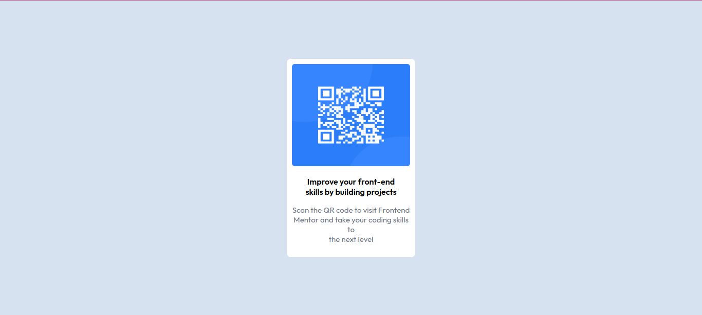

# Frontend Mentor - QR code component solution

This is a solution to the [QR code component challenge on Frontend Mentor]
(https://www.frontendmentor.io/challenges/qr-code-component-iux_sIO_H). 
## Table of contents

- [Overview](#overview)
  - [Screenshot](#screenshot)
  - [Links](#links)
- [My process](#my-process)
  - [Built with](#built-with)
  - [What I learned](#what-i-learned)
  - [Continued development](#continued-development)
- [Author](#author)
- [Acknowledgments](#acknowledgments)

## Overview

### Screenshot

### Links

- Solution URL: (https://github.com/Afoma/QR-Code-Component)
- Live Site URL: (https://qr-code-component-blush-eight.vercel.app/)

## My process

### Built with

- Semantic HTML5 markup
- CSS custom properties
- Flexbox
- CSS Grid
- Mobile-first workflow

### What I learned

In CSS, it is important to always create a wild card at the beginning of your styling by writing a '*'. Inside it, you make "box-sizing: border-box". You make the box-sizing to be border-box so that whatever padding or margin you are creating will not make the div expand or take more space in the body of the page but it will rather take up the space within the div that you are styling. It is important to create a wild card and style it so that the rules you create inside it will apply to everything in the style code base.

It is usually better to use 'dvw (dynamic viewport height)' and 'dvh (dynamic viewport height)' instead of 'vw' and 'vh' because it also takes into consideration mobile phone devices unlike 'vw' and 'vh'.

If you use repeating numbers in your color code, it will result in a shade of grey.
Example #afafaf, rgb(107,107,107). The alpha values determine the opacity.

To auto-generate a Lorem ipsum text in your html page, write Lorem and press the enter key.

When deploying a project to go live, in order to avoid a 404 error message, make sure that you
are deploying the root directory, that is, the particular directory in which your code is 
located, except your project is not located in a subdirectory.

### Continued development
I will be imnplementing BEM methodology in my next project's styling and JavaScript in the subsequent one. 

## Author

- Website - [Afoma](https://github.com/Afoma)
- Frontend Mentor - [@Afoma](https://www.frontendmentor.io/profile/Afoma)
- Twitter - [@afoma_orji](https://www.twitter.com/afoma_orji)

## Acknowledgments

Thank you [Samson](https://github.com/pablo-clueless) for helping me to overcome some of the styling and deployment challenges I encountered in the course of this project. 

